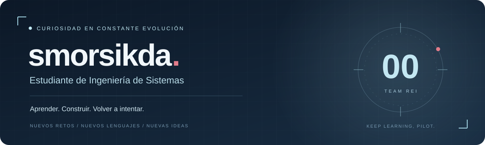

  

  <b>Un reto nuevo. Algo más por aprender. Una idea que convertir en código.</b>

  <a href="https://github.com/smorsikda?tab=repositories">Explora mis repositorios</a>
  &nbsp; · &nbsp;
  <a href="https://github.com/smorsikda/nestjs">Mi práctica con NestJS</a>

---

### 👋 Detrás del código

Soy **estudiante de Ingeniería de Sistemas**, con curiosidad por entender cómo funcionan las cosas y ganas de aprender a construirlas mejor.

Me entusiasman los retos que me obligan a salir de lo conocido: explorar un lenguaje, entender una tecnología o encontrar ese detalle que hace que todo finalmente funcione. Me gusta aprender haciendo, hacer preguntas y convertir los errores en pistas para el siguiente intento.

Este perfil es mi bitácora: aquí comparto prácticas, experimentos y proyectos que acompañan mi formación. Cada repositorio guarda una parte del proceso, desde el primer intento hasta ese pequeño **“¡ya funciona!”** que hace que valga la pena.

> **Mi objetivo: que cada proyecto me deje mejores preguntas, nuevas herramientas y un poco más de criterio.**

### 🧊 Mi enfoque actual

- **Backend con NestJS:** comprender cómo se organizan los módulos, controladores y servicios.
- **JavaScript y TypeScript:** fortalecer mis bases y aprender a escribir código más claro.
- **APIs y datos:** explorar Prisma, bases de datos y autenticación paso a paso.
- **Aprendizaje constante:** probar nuevos lenguajes y entender cuándo tiene sentido utilizarlos.

  
  
  
  
  

Herramientas que forman parte de mi camino de aprendizaje.

### 🛠️ En construcción

**[Práctica de backend con NestJS →](https://github.com/smorsikda/nestjs)**  
Mi espacio para llevar lo aprendido en clase al código y avanzar hacia una API con datos, documentación y autenticación.

**[Más repositorios →](https://github.com/smorsikda?tab=repositories)**  
Otras ideas, ejercicios y proyectos de mi recorrido.

### 🌙 Un dato esencial

**Rei > Asuka.**  
Mi única decisión de arquitectura que no pienso refactorizar.

---

  <b>La curiosidad pone la primera línea. La constancia escribe el resto.</b> 
  Gracias por pasar por aquí. Nos vemos en el próximo commit. 🧊

