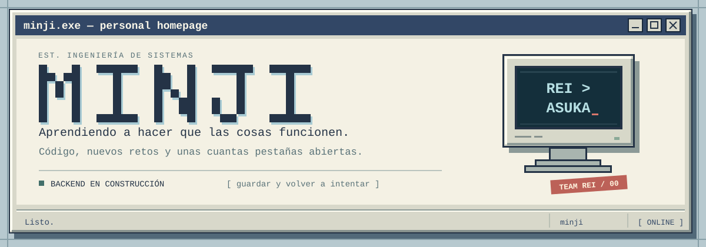
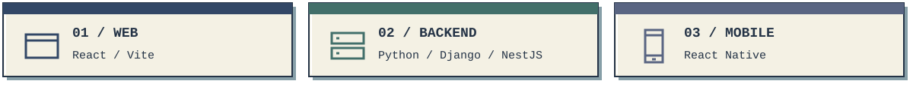

  

  <b>Estudiante de Ingeniería de Sistemas · Full stack en formación</b> 
  Me gusta entender lo que pasa desde el primer clic hasta la última consulta.

  
  
  

---

### 💾 01 / Sobre mí

**Hola, soy Minji.** Estudio Ingeniería de Sistemas y me entusiasman los retos que me hacen aprender algo nuevo. Tengo conocimientos de desarrollo web, backend y aplicaciones móviles, y sigo ampliando mi caja de herramientas con cada proyecto.

Me gusta pasar de una idea a una interfaz, conectar esa interfaz con una API y entender qué ocurre por dentro. Conozco **React, Vite y React Native**, además de distintos lenguajes y herramientas que voy usando a lo largo de mi formación.

Aquí guardo mis prácticas, experimentos y proyectos. También los intentos que me enseñaron por qué algo no funcionaba. Preguntar, probar y volver a intentar es parte del proceso.

> **Mi siguiente proyecto siempre tiene algo que todavía no sé hacer. Ahí está lo interesante.**

  

### 🖥️ 02 / Mi caja de herramientas

**Frontend · lo que ves y con lo que interactúas**

  
  
  
  
  
  

HTML y CSS para estructura y estilos; JavaScript y TypeScript para la lógica; React para interfaces por componentes y Vite como herramienta de desarrollo.

**Backend · lo que hace que todo funcione**

  
  
  
  
  

Conocimientos de Python, Django y PHP. Actualmente profundizo en Node.js y NestJS para construir APIs y organizar la lógica del servidor.

**Mobile · ideas que caben en el bolsillo**

  
  
  

También conozco React Native y me interesa conectar las experiencias web y móviles con un mismo backend.

**Otros lenguajes y control de versiones**

  
  
  
  
  
  

C, C#, C++ y Java también forman parte de mis conocimientos. Me gusta comparar sus enfoques y entender qué herramienta encaja mejor con cada problema.

### 🧩 03 / Mi siguiente nivel full stack

Mi ruta para seguir creciendo conecta **interfaces, servicios y datos**:

- **Frontend:** profundizar en React y TypeScript, accesibilidad y diseño adaptable.
- **Backend:** seguir practicando APIs, validación y autenticación con NestJS y Django.
- **Datos:** incorporar **SQL y PostgreSQL** y avanzar con Prisma en mis prácticas.
- **De principio a fin:** conectar las piezas, probarlas y aprender a desplegar aplicaciones completas.

<b>📂 Abrir carpeta: recursos de mi ruta</b>

- [React — interfaces por componentes](https://react.dev/)
- [Vite — entorno de desarrollo web](https://vite.dev/guide/)
- [React Native — aplicaciones móviles](https://reactnative.dev/)
- [PostgreSQL — introducción a SQL y bases de datos relacionales](https://www.postgresql.org/docs/current/tutorial.html)

### 🛠️ 04 / En mi escritorio

**[Práctica de backend con NestJS ↗](https://github.com/smorsikda/nestjs)**  
Llevando lo aprendido en clase al código: mi camino hacia una API con datos, documentación y autenticación.

**[Explorar mis repositorios ↗](https://github.com/smorsikda?tab=repositories)**  
Más ejercicios, proyectos e ideas de mi recorrido.

---

  <code>guardar progreso → aprender algo → volver a intentar</code>

  <b>Rei &gt; Asuka.</b> 
  Mi única decisión de arquitectura que no pienso refactorizar.

MINJI · Gracias por visitar mi rincón de internet.

